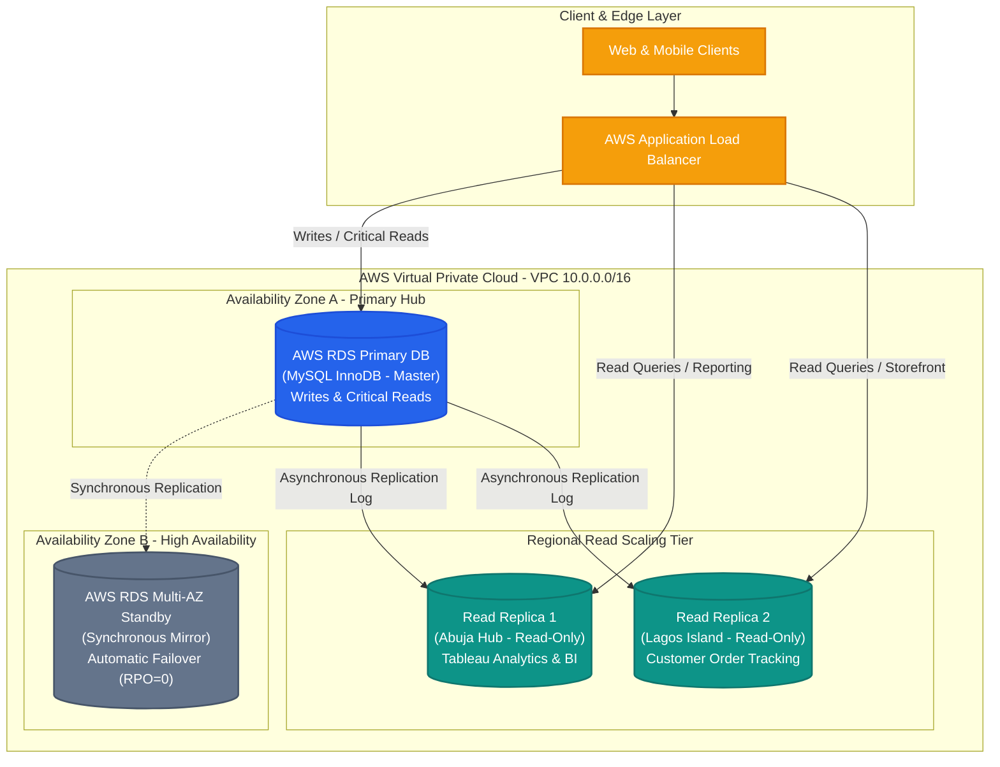

```mermaid
graph TD
    subgraph Client_Layer [Client & Edge Layer]
        Users[Web & Mobile Clients]
        ALB[AWS Application Load Balancer]
        Users --> ALB
    end

    subgraph AWS_VPC [AWS Virtual Private Cloud - VPC 10.0.0.0/16]

        subgraph AZ_Primary [Availability Zone A - Primary Hub]
            RDS_Primary[("AWS RDS Primary DB<br/>(MySQL InnoDB - Master)<br/>Writes & Critical Reads")]
        end

        subgraph AZ_Standby [Availability Zone B - High Availability]
            RDS_Standby[("AWS RDS Multi-AZ Standby<br/>(Synchronous Mirror)<br/>Automatic Failover (RPO=0)")]
        end

        subgraph Edge_Replicas [Regional Read Scaling Tier]
            Replica_Abuja[("Read Replica 1<br/>(Abuja Hub - Read-Only)<br/>Tableau Analytics & BI")]
            Replica_Lagos[("Read Replica 2<br/>(Lagos Island - Read-Only)<br/>Customer Order Tracking")]
        end

        ALB -->|Writes / Critical Reads| RDS_Primary
        RDS_Primary -.->|Synchronous Replication| RDS_Standby
        RDS_Primary -->|Asynchronous Replication Log| Replica_Abuja
        RDS_Primary -->|Asynchronous Replication Log| Replica_Lagos
        ALB -->|Read Queries / Reporting| Replica_Abuja
        ALB -->|Read Queries / Storefront| Replica_Lagos
    end

    classDef primary fill:#2563eb,stroke:#1d4ed8,stroke-width:2px,color:#ffffff;
    classDef standby fill:#64748b,stroke:#475569,stroke-width:2px,color:#ffffff;
    classDef replica fill:#0d9488,stroke:#0f766e,stroke-width:2px,color:#ffffff;
    classDef lb fill:#f59e0b,stroke:#d97706,stroke-width:2px,color:#ffffff;

    class RDS_Primary primary;
    class RDS_Standby standby;
    class Replica_Abuja,Replica_Lagos replica;
    class ALB,Users lb;
```
